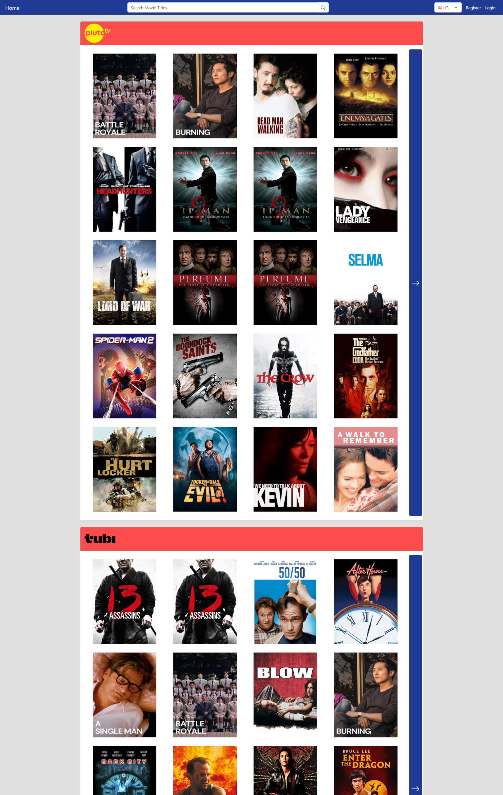
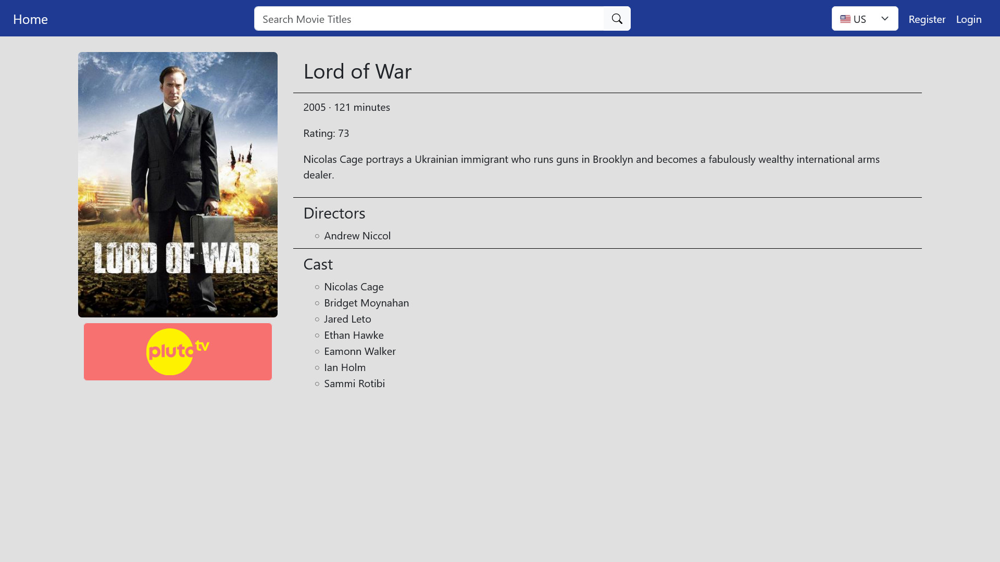
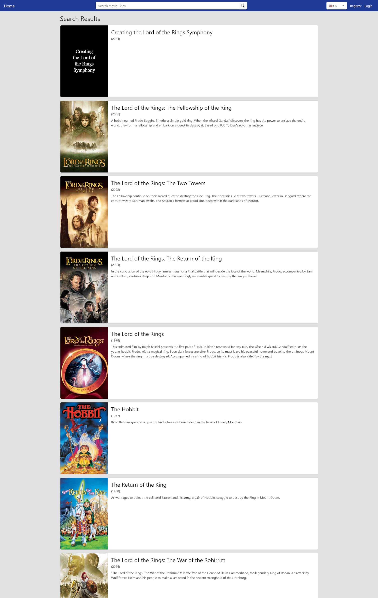

# Free Stream Movies

https://myron-chen-free-stream-movies.onrender.com/

A website for finding free movies to stream.

### Home page

### Details page

### Search results

## Overview

This web app shows a list of streaming services that provide currently available free movies to stream. Users can
choose which country to show options for, view movie details, and search movie titles to see if a particular title
is free.

## Features

- Allow selecting a country to display free movies for. The choice will be saved in a browser cookie.
  - The movie data isn't restricted only to the United States. To allow everyone to benefit, and to not needlessly
    show streaming options a user can not use, movies are displayed in accordance to country, with users being
    able to select the country. This allows the web app to be used across the world.
- List streaming services that provide free streaming options, and their movies.
  - This is the main feature of the the website. This shows what movies are available for free on what streaming
    providers. This allows people to easily find free movies, instead of trying to find the movies by going through
    lists of paid and subscription options, or filtering for free options.
- Search all movies by title.
  - Allows users to easily find a specific movie, to see if it is free or to see its info.
- Movie details page, which also displays list of links to streaming options.
  - Shows detailed info such as release year, cast, and runtime. Also shows all of the free streaming options
    across different streaming providers.
- User accounts.
  - Allows for future features such as adding movies to watchlists and emailing users when a movie becomes free.
- Viewable on mobile devices and on desktops.
  - Most people view websites on their phones. Having the web app work well on both small and large screens allows
    it to be accessible to a wider audience.
- Database is easily updatable with new data from the external API.
  - Free streaming options do not last forever. To keep the displayed movies current, a developer can run a file
    to call the API and to save the retrieved data into the database.

## User Flow

On the homepage, streaming providers are shown with their movies. For each streaming provider, a max of 20 movies are
shown at a time. Users can click on the left and right arrows to scroll the movie options for a provider. Streaming
providers with no free streaming options are not shown.

Users can select a country from the navigation bar, which will then reload the webpage and populate the list of
streaming services and movies for that country.

Clicking on a movie will go to the movie details page and show movie info like release year, rating, runtime,
description, directors, and cast. The details page will also show the list of free streaming options, if there are
any, and whether the options are expiring soon. Clicking on an option from a streaming provider will redirect to that
provider's movie's page.

At the top, in the navigation bar, users can type in a movie title to search for. Upon sending a search request, a
new page is displayed with a list of movie results, along with their descriptions. Clicking on a result leads to the
details page.

To create an account, users can click on the "Register" link in the navbar at the top-right. A form is displayed
with fields username, password, repeat password, and email. If username or email is not unique, or if the repeated
password is not the same as the first password inputted, an error will be shown.

If users already have an account, they can log in through the "Login" link in the navbar at the top-right.

After registering or logging in, users will be redirected to the homepage. Users will stay logged in after closing
their browsers.

If logged in, the "Register" and "Login" links will not be shown. Instead, the "Logout" link will be shown. Users can
click on the "Logout" link in the navbar to log out.

## External APIs

### Streaming Availability API

https://www.movieofthenight.com/about/api/  
https://rapidapi.com/movie-of-the-night-movie-of-the-night-default/api/streaming-availability

This has a limited number of streaming services.

## Tech Stack

- Python
- Flask
- PostgresQL
- Flask-SQLAlchemy
- Flask-Bcrypt
- Flask-Login
- Flask-WTF (WTForms)
- Jinja
- HTML
- CSS
- JavaScript
- JQuery
- Axios
- Bootstrap

## Other

Project Ideas:
https://docs.google.com/document/d/1EYCoiANIPEsIVZTgVDpPSY2jYtedfrGOQlAPqVkLT3o/edit?usp=sharing

Proposal:
https://docs.google.com/document/d/1WoXzewIRBwGr2g7bMLV0evk-s5cDGe1VeVO0oxh2WJI/edit?usp=sharing

## How To Set Up And Run

### Running Locally

1. Create a `.env` file in the root directory and include

   - `SECRET_KEY` (secret key for Flask app)
   - `RAPID_API_KEY` (API key for using Streaming Availability API)

2. Seed local database by running

   > py src/seed/streaming_availability_seeder.py

   May need to manually uncomment/comment functions at bottom of file to choose what data to seed with.
   Due to external API rate limits, the seeding will have to be done repeatedly over a few days.

3. Start app by running

   > py src/app.py

4. Occasionally update local database by running

   > py src/seed/streaming_availability_updater.py

### Running On A Web Host

The [Render](https://render.com/) server and [Supabase](https://supabase.com/) database hosting sites
will be used as examples.

A local database with data is needed beforehand.

#### On Supabase:

1. Create a new Organization and Project.

2. Select region.

3. Create a password for database access.

4. Create project and wait until it is completed.

5. Go to **Project Settings > Database > Connection string > PSQL**, and copy PSQL string.

6. Dump local database into Supabase by opening terminal and running

   > pg_dump -U {PostgreSQL user with permission} -O {local database name} | {PSQL string}

   - This seems to only work for new Supabase databases.

7. Input password for database dump.

#### On Render:

1. Create a web service on Render and connect it to this repository. As of now, use branch `dev`, but in the future,
   this might change to `main`.

2. Give the service a globally unique name.

3. Set the build command to install dependencies using the `requirements.txt` file in the root directory.
   This should be the default.

4. Set the start command to

   > gunicorn prod_server:app.

5. Set environment variables:

   1. `DATABASE_URL` = URL from Supabase
   2. `PYTHON_VERSION` = 3.12.4

6. In the "Secret Files" section, create a file named `.env` and add

   - `SECRET_KEY` (secret key for Flask app)
   - `RAPID_API_KEY` (API key for using Streaming Availability API)

7. Create the web service.

### How To Update Supabase with local database

#### Using pgAdmin:

1. First get Supabase database connection string info.

   - For a project, **Project Settings > Database > Connection string > Python**.

2. In pgAdmin's Object Explorer window, right-click and select **Servers > Register > Server**.

3. Under General tab, input name.

4. Under Connection tab, input/change the following by using the Supabase connection info.

   - Host name/address
   - Port
   - Username
   - Password (database's)
   - Enable Save Password

5. Save the new server.

6. In Object Explorer, right-click on **{local server} > Databases > {local database name}** and select **Backup...**.

7. Under General tab, input name.

8. Under Data Options tab, do not save Owner and Privileges.

9. Click Backup.

10. In Object Explorer, right-click on **{new server} > Databases > postgres** and select **Restore...**.

11. Under General tab, select and input Filename for backup.

12. Under Data Options tab, do not save Owner and Privileges.

13. Under Query Options, enable "Clean before restore".

14. Click Restore.

## How To Run Tests

### Run all tests

`py -m unittest tests/*/test_*.py`

### Run all tests with coverage

1. `coverage run -m unittest tests/*/test_*.py`
2. `coverage html`

The coverage report will be generated in the `htmlcov` folder.
