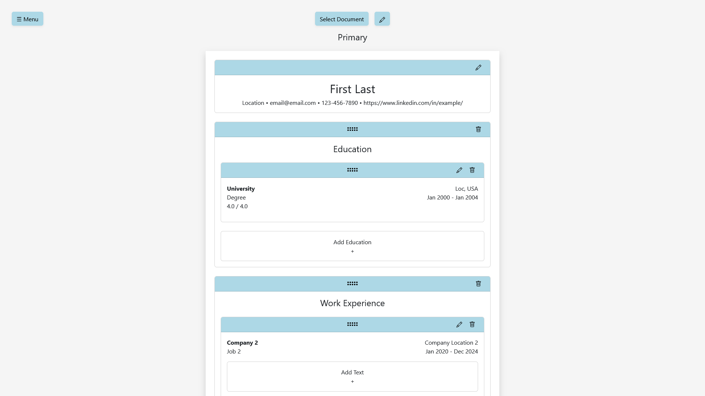

# Resume Manager

https://myron-chen-resume-manager-frontend.onrender.com  
https://myron-chen-resume-manager-backend.onrender.com

Create and manage multiple resumes from one template.

## Overview

Users can work on a master resume, inputting info like contact information,
education, and experience, as well as reorder them. Then users can create new
resumes for individual job applications and choose which educations,
experiences, achievements, etc. from the master resume to show on the new
resumes. If a piece of information needs to be changed, it can be changed in the
master resume, which will then propagate the changes to all of the other
resumes.

## Features

- Create, update, and delete sections in one place.

  - Information is only set in the master resume, so that users do not have to
    go find where the source is whenever they need to make changes to the info.

- Automatic updating info to other resumes.

  - Info in resumes will automatically be updated if the info in the master
    resume is updated, which saves from having to spend time going through each
    resume and making edits.

- Drag and drop info to reorder them.

  - Easily and intuitively allows for rearranging sections, instead of clicking
    on buttons to move sections and achievements one place at a time.

## User Flow

On the homepage, users can choose to register or sign in. After logging into an
account, users will be redirected to a webpage that will first require selecting
a document or creating a new one. The master resume will automatically be
created upon account creation. If creating a new one, users will input the
document name.

Once a document has been selected, users can edit the document's properties,
which is currently just the name, by clicking the pencil icon on the top of the
webpage and next to the "Select Document" button. If the document is not the
master resume, it can also be deleted by clicking on the adjacent trash icon
twice. Another document can be selected by clicking on the "Select Document"
button. The document name is shown just below that.

At the top left is the menu button. Clicking on it will give the navigation
links to work on the document, change account settings, and sign out. For
account settings, only changing the password is currently available. Users will
need to put the old password, for verification, and the new password twice, so
that the new password is not incorrectly typed.

The following is for the master resume.

At the top of the resume page, clicking on the pencil icon for the contact info
card opens a form to allow inputting contact information. Clicking on the pencil
icon again cancels the form.

Below the contact info, users can click on the "Attach Section" zone/button to
add a section. In the new section, an individual education, experience, or etc.
can be added similarly by clicking on the "Add" zone. For some sections, like
experiences, users can further add snippets of text, like achievements. If
adding, a form will be shown at where the new item will be, where required
fields will have asterisked names. When viewing forms to create info, the forms
can be canceled by clicking on the trash icon twice.

Users can edit/update existing info by clicking on the pencil icon in the header
of the card that contains the info. Clicking on the pencil will open the same
form as when creating a new piece of info, except that the existing info will be
prefilled in the form fields. Editing can be canceled by clicking on the pencil
icon again.

Info can be reordered among themselves by holding the grip icon at the center
top of cards, dragging them, and dropping them. The new positions will be saved
after a few seconds.

The following is for resumes that is not the master resume.

Working on a document that's not the master resume will work almost the same,
except info can not be created, updated, or deleted. When clicking on the trash
icon, the info is removed from that document only; the info will still exist in
the master resume and in other resumes. When clicking on the "Attach" zone, a
form with a dropdown of the info items to attach will be presented. The info
items are pulled from the master resume.

## API

Since this app is about resumes, a database needed to be designed with tables
for contact info, education, experience, and more for each section or type of
info in a resume. Since each type of info is its own entity, in order to
associate them to the document, relationship tables needed to be created as
well.

The tables are users, contact_info, documents, sections, text_snippets,
educations, experiences, skills, certifications, projects, and the relationships
between some of them. Although skills, certifications, and projects are not
utilized yet. These are standard tables, except for text_snippets.

Text snippets were designed to be strings of text; such as achievements, bullet
points, summaries, or skills; with different versions to originally allow users
to search for and use past achievements (though this was not implemented in
time), if the achievements sounded good for a particular job opening. To allow
this, the text_snippets needed an attribute named parent, which is a reference
to another text_snippets record's version, to allow looking up the text
snippet's old versions.

The tables for storing many-to-many relationships between the document and
sections or, for example, experience and text snippets are mostly standard. The
relationship tables for text snippets and sections only uses text snippet IDs as
the part of the primary keys though. This is done to prevent other versions of a
text snippet to be included in a document, which would not make sense as people
would not have something like two nearly identical achievements for a job. Also,
there is a UNIQUE constraint in relationship tables for position and section ID,
that is deferrable to allow changing all text snippets for an experience or
project at once, instead of having to set the positions to unused positions and
setting them back. In other words, deferring the UNIQUE constraint allows for
easily changing the positions of multiple section or text snippet items all at
once.

For users to store and interact with their info, POST, GET, PATCH, and DELETE
routes are needed for all the different sections, relationships, and text
snippets. PUT routes were used for reordering info, because it wouldn't make
sense to use PATCH, since reordering does not involve modifying a single table
record's attributes, and it wouldn't make sense to use POST, because nothing new
is being created.

JSON schemas are used to easily validate user inputs, instead of having to write
the validation code out and creating lengthy tests for them. There is a routes
layer in the back-end infrastructure to handle validations and bundle data up to
deliver back to clients. There is a services layer for additional validations,
which can jointly be used to then output data for processing, and data
processing. There is a models layer for storing the data models and the
functions to interact with the database.

## Tech Stack

### Backend

- Node
- Express
- PostgreSQL
- bcrypt
- JSON Schema
- JSON web token

### Frontend

- Vite
- React
- React Router
- @hello-pangea/dnd
- axios
- Reactstrap / Bootstrap

### Languages

- JavaScript
- HTML
- CSS

## Other

Project Ideas:
https://docs.google.com/document/d/1LRdXCzlBXjPrmYRjIpqrpGkyismcqxcv_0icOwqcW8c/edit?usp=sharing

Proposal:
https://docs.google.com/document/d/1vCY6kOsufSE4MVSxv_L9wkCuaDrCS4Zuc_DrBaxaDoM/edit?usp=sharing

## How To Set Up And Run

### Running Locally

#### Back-end

1. (optional) Create a `.env` file in the root directory of the back-end and
   include

   - `NODE_ENV="prod"`

2. Seed local database by running `\database\setup.sql` in psql, PostgreSQL's
   interactive terminal.

   One way of doing this is to

   1. Go to that directory.
   2. Start a terminal.
   3. Run command
      > psql -U postgres.
   4. In psql, run
      > \i setup.sql.

3. Start back-end by running

   > npm start

   or

   > npm run dev

   if doing development so that the server can restart automatically when code
   changes.

#### Front-end

1. Run

   > npm run dev

   if doing development so that the server can restart automatically when code
   changes, or

   > npm run build

   > npm run preview

   if viewing the production-grade version.

### Running On Web Hosts

Instructions are only given for [Render](https://render.com/) server and
[Supabase](https://supabase.com/) database hosting sites.

A local database is needed beforehand. Example data can optionally be added.

#### Supabase

See [Migrate from Postgres to
Supabase](https://supabase.com/docs/guides/platform/migrating-to-supabase/postgres?queryGroups=migrate-method&migrate-method=cli#migrate-the-database)
article on _supabase.com_ for reference.

1. Create a new organization and project. For organization, input **Name**,
   select **Personal** for **type**, and select **Free** for **Plan**. For
   project, input **Project Name**, **Database Password**, and **Region**.

2. In the project, after it finishes setting up, and at the top of the website,
   click on **Connect**. Under the **Connection String** tab, select type to be
   **PSQL** and copy the **Session pooler** string.

   Get the **URI** **Session pooler** string as well, which will be used later
   for the back-end service, by changing the type to **URI** and doing the same
   thing. Replace the password placeholder with the database password.

3. Start a terminal anywhere and run

   > pg_dump --clean --if-exists --quote-all-identifiers \  
   > -h $HOST -U $USER -d $DATABASE \  
   > --no-owner --no-privileges > dump.sql

   and replace the $ variables. For example,

   > pg_dump --clean --if-exists --quote-all-identifiers -h localhost -U
   > postgres -d resume_manager --no-owner --no-privileges > dump.sql

   This dumps the local database and creates a `dump.sql` file.

4. Then paste into the terminal the session pooler string, add `-f dump.sql`,
   and run it. The format will be

   > psql -h $HOST -p $PORT -d $DATABASE -U $USER -f dump.sql

   Replace $ variables. For example,

   > psql -h aws-0-us-east-2.pooler.supabase.com -p 5432 -d postgres -U
   > postgres.abcdefghijkl -f dump.sql

   Then input database password when prompted to begin the transfer. This will
   import the database, that is saved in the `dump.sql`, into the Supabase
   project.

#### Render

##### Back-end

1. Find and select the action to create a new web service.

2. In the configuration, select the back-end repository for **Source Code**.

   - If the repository does not show up, then the Render installation on GitHub
     might need to be configured. This could be done by looking at the connected
     deployment credentials and clicking on an option to configure in GitHub, or
     going to **GitHub > settings > Integrations > Applications > Render >
     Configure**.

3. Input a globally unique **Name** (note that this will be used to name the
   URL, which can't be changed later!).

4. Select `main` for **Branch**.

5. Select the free **Instance Type**.

6. In the **Environment Variables** section, set

   - `DATABASE_URL` to be the Supabase URI session pooler string.
   - `NODE_ENV` to be `prod`.
   - `SECRET_KEY` (auto-generate this).

7. Click **Deploy Web Service**.

##### Front-end

1. Find and select the action to create a new static site.

2. In the configuration, select the front-end repository for **Source Code**.

   - If the repository does not show up, then the Render installation on GitHub
     might need to be configured. See above instructions for back-end.

3. Input a globally unique **Name** (note that this will be used to name the
   URL, which can't be changed later!).

4. Select `main` for **Branch**.

5. Input `dist` for **Publish Directory**.

6. In **Environment Variables**, set

   - `VITE_BACKEND_URL` to be the URL for the back-end on Render.

7. Click **Deploy Static Site**.

## How To Run Tests

Tests are located next to the files that contain the production code.

Jest is not a part of the packages and needs to be installed.

### Run all tests either in back-end or front-end

> npm test

### Run all tests with coverage either in back-end or front-end

> npm run coverage

Coverage report can be opened in `coverage/lcov-report/index.html`.
